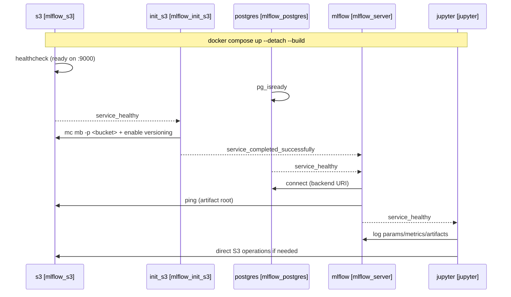

<!-- SPDX-License-Identifier: Unlicense -->

# JupyterLab data science environment

A GPU-ready environment for data science and deep learning experiments with
JupyterLab, Fast.ai, and MLflow tracking server (with MinIO + PostgreSQL).

* **Jupyter** for interactive dev & training (GPU-ready).
* **MLflow** as tracking/UI.
* **PostgreSQL** as MLflow backend store (experiments, params, metrics).
* **MinIO (S3)** as artifact store (models, plots, notebooks).
* **init\_s3** as one-time bucket initializer.

## Topology



## Data flow

1. Notebook runs in **Jupyter**.
2. Code calls MLflow client (`mlflow.log_*` / `autolog()`).
3. **MLflow** writes metadata to **Postgres**.
4. **MLflow** uploads artifacts to **MinIO** under `s3://$MINIO_BUCKET/...`.
5. You inspect runs in MLflow UI; raw artifacts visible via MinIO Console.

## Volumes

* `postgres_data` → Postgres cluster data
* `minio_data` → MinIO object store
* `./workspace` ↔ `/home/<NB_USER>` (your notebooks/code)

Back up by snapshotting volumes + the workspace directory.

## Minimal code contracts

Notebook snippet (already preconfigured via env):

```python
import mlflow

mlflow.set_experiment("notebooks")

with mlflow.start_run(run_name="demo"):
  mlflow.log_param("lr", 3e-4)
  mlflow.log_metric("loss", 0.12)
  mlflow.log_artifact("some_output.txt")
```

## Features

* JupyterLab with pre-installed data science libraries (pandas, numpy,
  matplotlib, scikit-learn)
* MLflow tracking server with MinIO (S3) and PostgreSQL backend
* Fast.ai deep learning framework
* NVIDIA GPU support (CUDA) via separate compose override
* Pre-configured workspace directory with canonical DS layout
* 2GB shared memory allocation
* Token-based Jupyter authentication
* Network isolation (frontend/backend)
* Pre-commit hooks (nbstripout, ruff)
* Makefile for common operations

## Prerequisites

* Docker and Docker Compose
* NVIDIA GPU with drivers (optional)
* NVIDIA Container Toolkit (for GPU support)

## Quick start

* Clone this repository
* Copy `.env.example` to `.env` and adjust for your needs.
  Then start the container:

```bash
make up
```

Or with GPU support:

```bash
make up-gpu
```

Or directly via Docker Compose:

```bash
docker compose up --build --detach
```

## Access

* JupyterLab    - http://localhost:8888 (token from `JUPYTER_TOKEN` in `.env`)
* MLflow UI     - http://localhost:5050
* MinIO console - http://localhost:9001 (credentials from `.env`)

## GPU usage

GPU support is provided via a separate compose override file.
Start with GPU:

```bash
make up-gpu
# or
docker compose -f docker-compose.yaml -f docker-compose.gpu.yaml up --detach --build
```

Ensure:

1. NVIDIA drivers are installed on the host
2. NVIDIA Container Toolkit is configured
3. GPU devices are available in Docker

Verify GPU access in JupyterLab:

```python
import torch
print(torch.cuda.is_available())
```

## Project structure

```text
.
├── docker-compose.yaml        # Orchestration of all services
├── docker-compose.gpu.yaml    # GPU override (nvidia devices)
├── .env                       # Environment variables (edit here)
├── Dockerfile.jupyter         # JupyterLab + fastai + mlflow client
├── Dockerfile.mlflow          # MLflow tracking server
├── Makefile                   # Common commands (make help)
├── requirements/
│   ├── jupyter.in             # Jupyter Python dependencies
│   └── mlflow.in              # MLflow Python dependencies
├── .pre-commit-config.yaml    # Pre-commit hooks (nbstripout, ruff)
└── workspace/                 # User working directory (mounted in Jupyter)
    ├── data/                  # Raw, processed, external data
    ├── notebooks/             # Exploration and training notebooks
    ├── src/                   # Reusable Python modules
    ├── models/                # Serialized models
    └── configs/               # Hyperparams, experiment configs
```

## Security notes

Default configuration uses token-based authentication for Jupyter.
For production use:

* Change `JUPYTER_TOKEN` from the default value
* Use HTTPS encryption
* Enable MLflow authentication
* Restrict network access

## Customization

Add packages to `requirements/jupyter.in`:

```text
your-package-name==1.0.0
```

Rebuild the container after changes:

```bash
make build
```

## Pre-commit hooks

Install pre-commit hooks to strip notebook outputs and lint Python code:

```bash
pip install pre-commit
pre-commit install
```

## Troubleshooting

### Permission issues

```bash
sudo chown -R $USER:$USER workspace/
```

### GPU not available

Make sure the NVIDIA driver is installed and `nvidia-smi` works on the host.

Verify that [NVIDIA Container Toolkit](https://docs.nvidia.com/datacenter/cloud-native/container-toolkit/latest/)
is installed and integrated with Docker:

```bash
sudo nvidia-ctk runtime configure --runtime=docker --set-as-default
sudo systemctl restart docker
```

Docker 25+ supports CDI but device specs must be generated first:

```bash
sudo nvidia-ctk cdi generate --output=/etc/cdi/nvidia.yaml
sudo systemctl restart docker
```

After that, this will work the same as `--gpus all`:

```bash
docker run --rm \
  --device=nvidia.com/gpu=all \
  nvidia/cuda:12.4.1-base-ubuntu22.04 nvidia-smi
```

### Port conflict

Change port mapping in docker-compose.yaml:

```yaml
ports:
  - 8889:8888
```

## Makefile targets

```bash
make help
```

| Target   | Description                          |
|----------|--------------------------------------|
| `up`     | Start all services                   |
| `up-gpu` | Start all services with GPU support  |
| `down`   | Stop all services                    |
| `build`  | Rebuild images without cache         |
| `logs`   | Tail logs from all services          |
| `ps`     | Show running services                |
| `clean`  | Stop services and remove volumes     |
| `help`   | Show available targets               |

## License

This project is provided for educational and research purposes
under the Unlicense terms.
