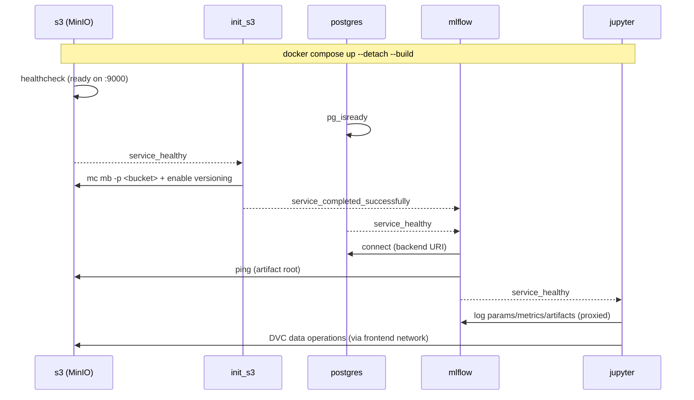

<!-- SPDX-License-Identifier: Unlicense -->

# JupyterLab data science environment

A GPU-ready environment for data science and deep learning experiments with
JupyterLab, PyTorch, and MLflow tracking server (with MinIO + PostgreSQL).

* **Jupyter** for interactive dev & training (GPU-ready).
* **MLflow** as tracking/UI with artifact proxying.
* **PostgreSQL** as MLflow backend store (experiments, params, metrics).
* **MinIO (S3)** as artifact store (models, plots, notebooks).
* **init\_s3** as one-time bucket initializer.

## Topology



## Data flow

1. Notebook runs in **Jupyter**.
2. Code calls MLflow client (`mlflow.log_*` / `autolog()`).
3. **MLflow** writes metadata to **Postgres**.
4. **MLflow** proxies artifact uploads to **MinIO** (`--serve-artifacts`).
5. You inspect runs in MLflow UI; raw artifacts visible via MinIO Console.
6. **DVC** tracks large datasets directly through MinIO via the frontend network.

## Volumes

* `postgres_data` → Postgres cluster data
* `minio_data` → MinIO object store
* `./workspace` ↔ `/home/<NB_USER>` (your notebooks/code)

Back up by snapshotting volumes + the workspace directory.

## Minimal code contracts

Notebook snippet (already preconfigured via env):

```python
import mlflow

mlflow.set_experiment("notebooks")

with mlflow.start_run(run_name="demo"):
  mlflow.log_param("lr", 3e-4)
  mlflow.log_metric("loss", 0.12)
  mlflow.log_artifact("some_output.txt")
```

## Features

* JupyterLab with pre-installed data science libraries (pandas, numpy,
  matplotlib, scikit-learn)
* MLflow tracking server with artifact proxying, MinIO (S3) and PostgreSQL
* PyTorch deep learning framework (Fast.ai available via template option)
* NVIDIA GPU support (CUDA) via separate compose override
* Pre-configured workspace with training template (Hydra + MLflow)
* Configurable shared memory (default 2GB, 8GB with GPU overlay)
* Configurable resource limits for core services
* Token-based Jupyter authentication
* Network isolation (frontend/backend)
* Reproducible builds with locked dependencies (uv)
* Data versioning with DVC (MinIO as remote)
* Pre-commit hooks (nbstripout, ruff)
* Copier template for project scaffolding

## Prerequisites

* Docker and Docker Compose
* NVIDIA GPU with drivers (optional)
* NVIDIA Container Toolkit (for GPU support)

## Quick start

Clone this repository, then generate a `.env` with random passwords:

```bash
make init
```

Start the stack:

```bash
make up
```

Or with GPU support:

```bash
make up-gpu
```

## Development workflow

The `workspace/` directory is a bind mount — files are shared between
the host and the Jupyter container. Use the host for git and the
container for compute:

* **Git on host** — run `git`, `pre-commit`, and `dvc` commands
  directly on the host machine. No git setup is needed inside the
  container.
* **VS Code** — open this repository and select *Reopen in Container*
  (requires the Dev Containers extension). VS Code attaches to the
  running Jupyter service with Python, Jupyter, and Ruff extensions
  pre-configured.
* **JupyterLab** — open <http://localhost:8888> in your browser for
  an interactive notebook experience.

## Access

* JupyterLab    - <http://localhost:8888> (token from `JUPYTER_TOKEN` in `.env`)
* MLflow UI     - <http://localhost:5050>
* MinIO console - <http://localhost:9001> (credentials from `.env`)

## Training and testing

A template training script with Hydra configuration and MLflow tracking
is provided at `workspace/src/train.py`:

```bash
make train                              # run with defaults
docker compose exec jupyter python src/train.py model.lr=0.01  # override params
make test                               # run pytest
```

## Data versioning (DVC)

DVC is pre-configured with MinIO as remote storage (`s3://dvc`).
Inside the Jupyter container:

```bash
dvc add data/raw/my_dataset.csv
git add data/raw/my_dataset.csv.dvc data/raw/.gitignore
make dvc-push   # upload to MinIO
make dvc-pull   # download from MinIO
```

## Optional profiles

Activate optional services using compose profiles:

| Profile | Command | Services |
| --- | --- | --- |
| `monitoring` | `make up-monitoring` | Prometheus (9090), Grafana (3000) |
| `orchestration` | `make up-orchestration` | Prefect server (4200) |
| `serving` | `make up-serving` | MLflow model serving (8080) |

Configure ports and credentials in `.env` (see `.env.example` for defaults).

## Copier template

This repository is a [Copier](https://copier.readthedocs.io/) template.
Generate a new project:

```bash
copier copy gh:your-org/this-repo /path/to/new-project
```

Parameters: `project_name`, `author`, `ml_framework` (fastai/pytorch/none),
`gpu_support` (bool).

## GPU usage

GPU support is provided via a separate compose override file.
Start with GPU:

```bash
make up-gpu
# or
docker compose -f docker-compose.yaml -f docker-compose.gpu.yaml up --detach --build
```

Ensure:

1. NVIDIA drivers are installed on the host
2. NVIDIA Container Toolkit is configured
3. GPU devices are available in Docker

Verify GPU access in JupyterLab:

```python
import torch
print(torch.cuda.is_available())
```

## Project structure

```text
.
├── docker-compose.yaml        # Orchestration of all services
├── docker-compose.gpu.yaml    # GPU override (nvidia devices)
├── .env                       # Environment variables (edit here)
├── Dockerfile.jupyter          # JupyterLab + fastai + mlflow client
├── Dockerfile.mlflow           # MLflow tracking server
├── Dockerfile.prefect          # Prefect orchestrator (optional)
├── Dockerfile.serving          # MLflow model serving (optional)
├── Makefile                   # Common commands (make help)
├── copier.yml                 # Copier template configuration
├── requirements/
│   ├── jupyter.in / .txt      # Jupyter deps (source + locked)
│   ├── jupyter.constraints    # Version constraints for Jupyter deps
│   ├── mlflow.in / .txt       # MLflow deps (source + locked)
│   ├── prefect.in / .txt      # Prefect deps (source + locked)
│   └── serving.in / .txt      # Serving deps (source + locked)
├── scripts/
│   ├── init-env.sh            # Generate .env with random passwords
│   ├── init-postgres.sql      # Create extra databases (prefect)
│   └── serve-model.sh         # Model serving entrypoint
├── monitoring/                # Prometheus + Grafana configs
├── .pre-commit-config.yaml    # Pre-commit hooks (nbstripout, ruff)
└── workspace/                 # User working directory (mounted in Jupyter)
    ├── data/
    │   ├── raw/               # Raw, unprocessed data
    │   ├── processed/         # Cleaned / transformed data
    │   └── external/          # Third-party data
    ├── notebooks/
    │   └── quickstart.ipynb   # MLflow tracking example
    ├── src/
    │   ├── train.py           # Training template (Hydra + PyTorch + MLflow)
    │   ├── config/train.yaml  # Hydra configuration
    │   ├── tests/             # Unit tests
    │   └── flows/             # Prefect flow definitions
    └── models/                # Serialized models
```

## Security notes

Default configuration uses token-based authentication for Jupyter.
For production use:

* Change `JUPYTER_TOKEN` from the default value
* Run `make init` to generate random passwords (instead of defaults)
* Use HTTPS encryption
* Enable MLflow authentication
* Restrict network access

## Customization

Add packages to `requirements/jupyter.in`:

```text
your-package-name==1.0.0
```

Regenerate locked dependencies and rebuild:

```bash
make lock
make build
```

## Pre-commit hooks

Install pre-commit hooks to strip notebook outputs and lint Python code:

```bash
pip install pre-commit
pre-commit install
```

## Troubleshooting

### Permission issues

```bash
sudo chown -R $USER:$USER workspace/
```

### GPU not available

Make sure the NVIDIA driver is installed and `nvidia-smi` works on the host.

Verify that [NVIDIA Container Toolkit](https://docs.nvidia.com/datacenter/cloud-native/container-toolkit/latest/)
is installed and integrated with Docker:

```bash
sudo nvidia-ctk runtime configure --runtime=docker --set-as-default
sudo systemctl restart docker
```

Docker 25+ supports CDI but device specs must be generated first:

```bash
sudo nvidia-ctk cdi generate --output=/etc/cdi/nvidia.yaml
sudo systemctl restart docker
```

After that, this will work the same as `--gpus all`:

```bash
docker run --rm \
  --device=nvidia.com/gpu=all \
  nvidia/cuda:12.4.1-base-ubuntu22.04 nvidia-smi
```

### Port conflict

Change port mappings in `.env`:

```bash
MLFLOW_PORT=5051
MINIO_CONSOLE_PORT=9002
```

## Makefile targets

Run `make help` for the full list. Key targets:

| Target             | Description                          |
| ------------------ | ------------------------------------ |
| `up`               | Start all services                   |
| `up-gpu`           | Start all services with GPU support  |
| `up-monitoring`    | Start with Prometheus + Grafana      |
| `up-orchestration` | Start with Prefect                   |
| `up-serving`       | Start with model serving             |
| `down`             | Stop all services                    |
| `build`            | Rebuild images without cache         |
| `lock`             | Regenerate locked dependencies       |
| `init`             | Generate .env with random passwords  |
| `train`            | Run training script in Jupyter       |
| `test`             | Run pytest in Jupyter                |
| `dvc-push`         | Push DVC data to MinIO               |
| `dvc-pull`         | Pull DVC data from MinIO             |
| `clean`            | Stop services and remove volumes     |

## License

This project is provided for educational and research purposes
under the Unlicense terms.
